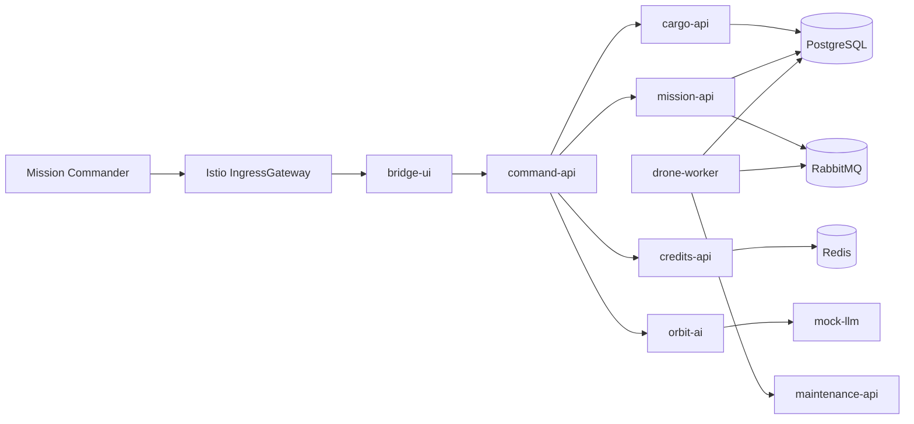

# Architecture

NebulaTrace is a small starship operations app. It uses deliberately mixed
languages so Dynatrace can show different instrumentation paths without adding
extra architecture.

## Services

| Service | Runtime | Role | Telemetry |
|---|---|---|---|
| `bridge-ui` | React + NGINX | Starship console | OneAgent optional |
| `command-api` | Node.js | API facade | OneAgent |
| `cargo-api` | Java Spring Boot | Cargo inventory and slow SQL | OneAgent |
| `mission-api` | Python FastAPI | Mission creation and RabbitMQ publish | OpenTelemetry |
| `credits-api` | Go | Fake credits authorization | OneAgent |
| `drone-worker` | Python | Async job consumer | OpenTelemetry |
| `maintenance-api` | Node.js | Repair status | OneAgent |
| `orbit-ai` | Python FastAPI | AI mission recommendations | OpenTelemetry |
| `mock-llm` | Python FastAPI | Local fake LLM | OpenTelemetry |
PostgreSQL, RabbitMQ, and Redis live in `nebulatrace-data` without Istio
sidecars. App workloads live in `nebulatrace` with Istio injection enabled.
